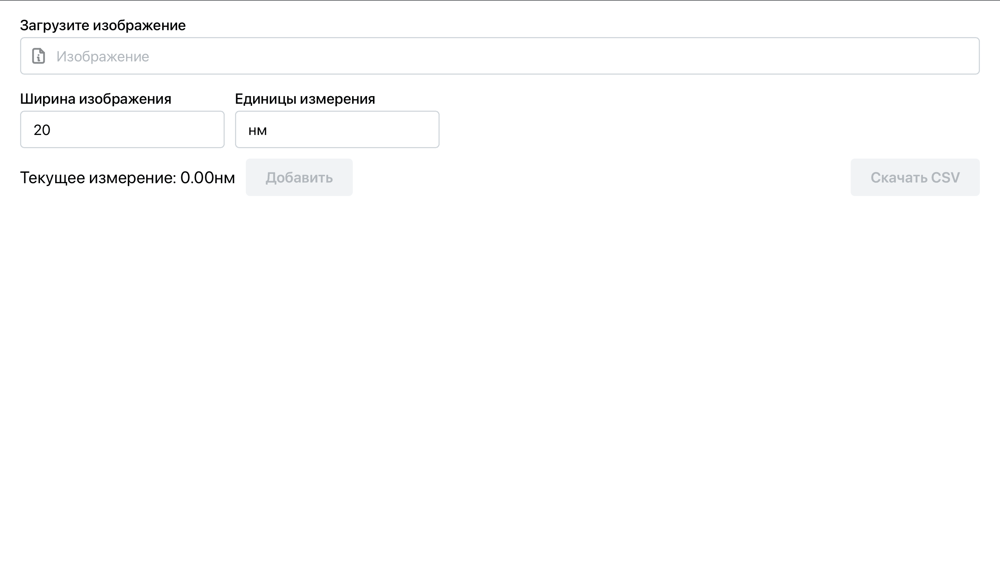
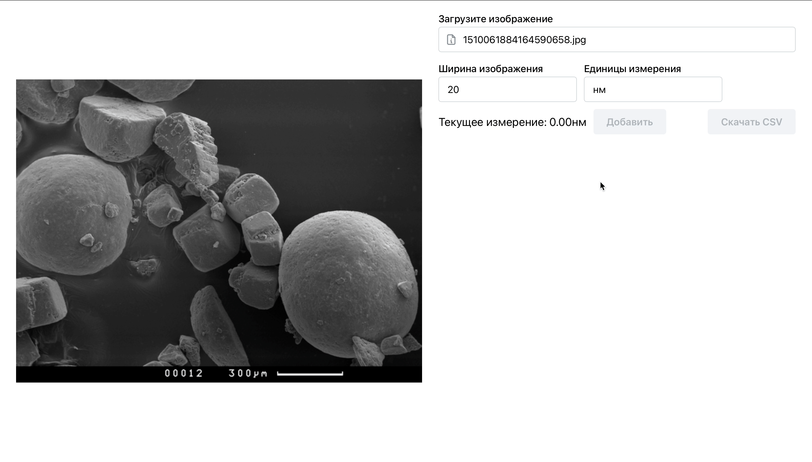
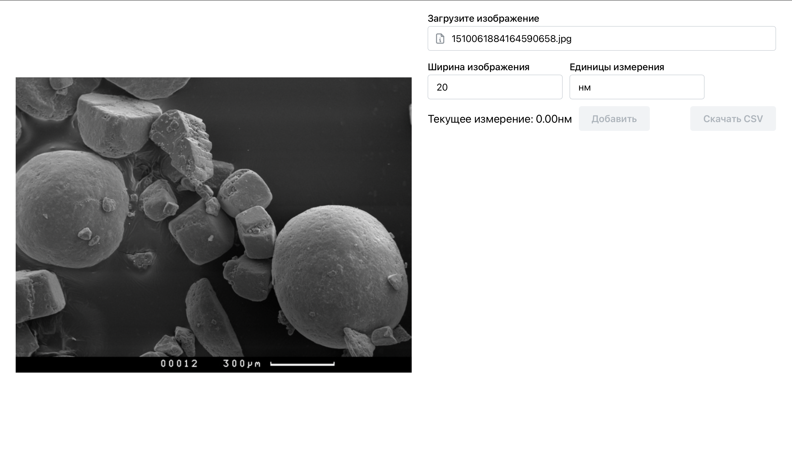
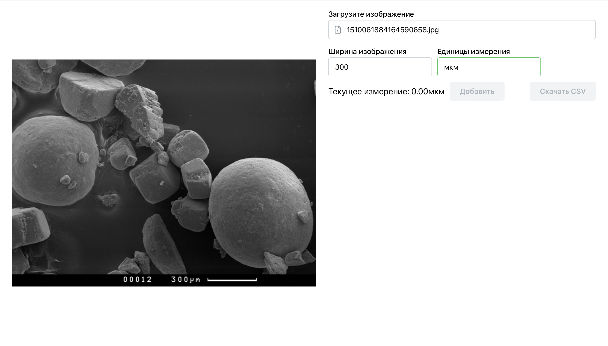
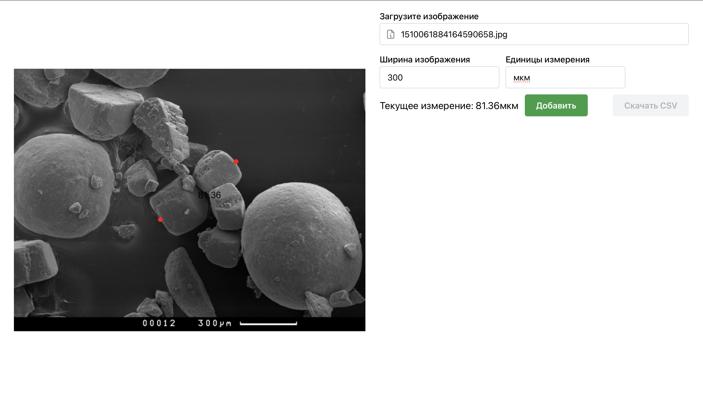
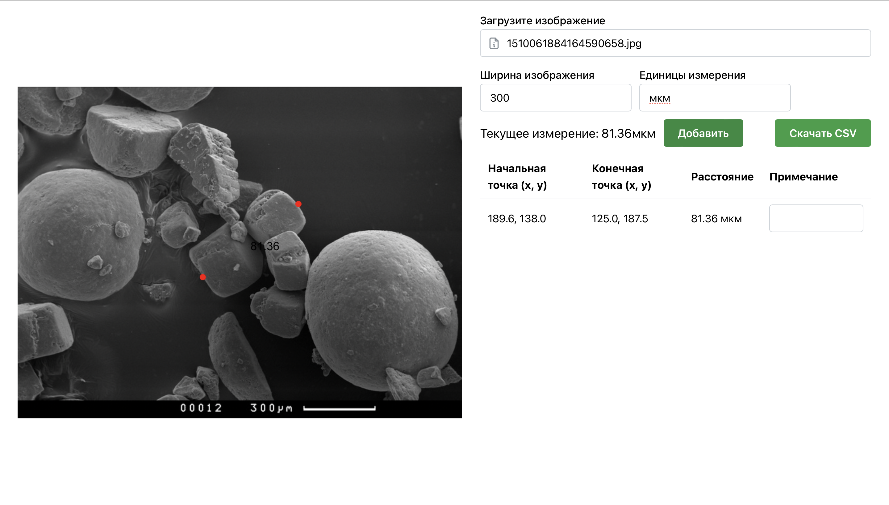
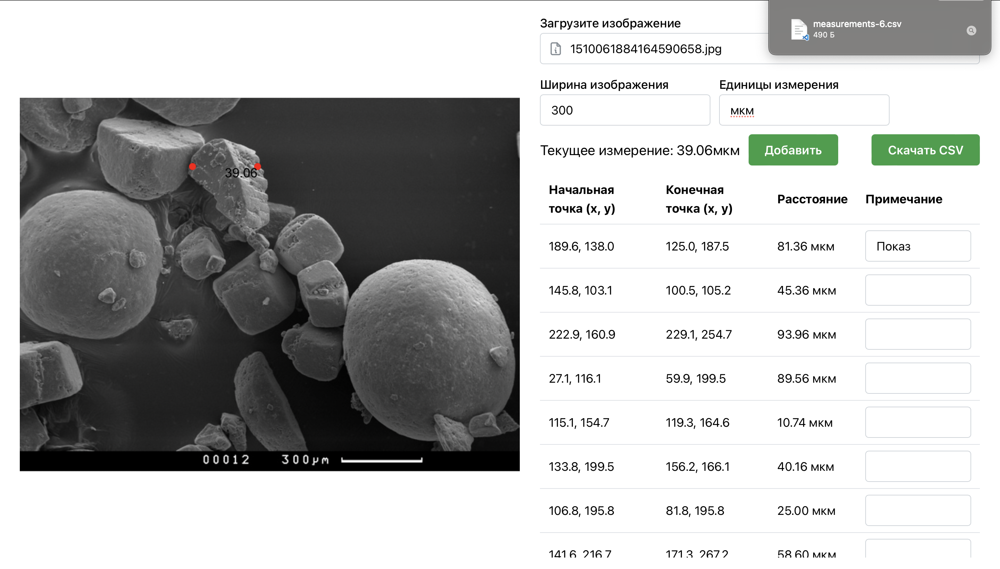

# PhotoPointApp
Веб-приложение для вычисления и сохранения расстояния между точками на снимке с микроскопа.

## Инструкция по работе в приложении

- Для запуска приложения перейдите по ссылке https://iu5git.github.io/PhotoPointApp/

- Загрузите изображение, кликнув по соответствующему полю:

- Введите в соответствующее поле ширину изображения и единицы измерения для правильных вычислений:

- Выберите две точки на снимке, между которыми необходимо вычислить расстояние:

- Чтобы сохранить выбранное расстояние, нажмите на кнопку "Добавить". В противном случае, просто выберите другие две точки:

- К каждому измерению можно добавить примечание. Для этого заполните поле "Примечание" у соответствующей записи в таблице измерений:

- Когда все необходимые измерения проведены, нажмите кнопку "Скачать CSV", чтобы сохранить данные в формате .csv:

- Для анализа следующего снимка - перезагрузите страницу и следуйте всем шагам выше. 

#### При перезагрузке страницы измерения не сохраняются!